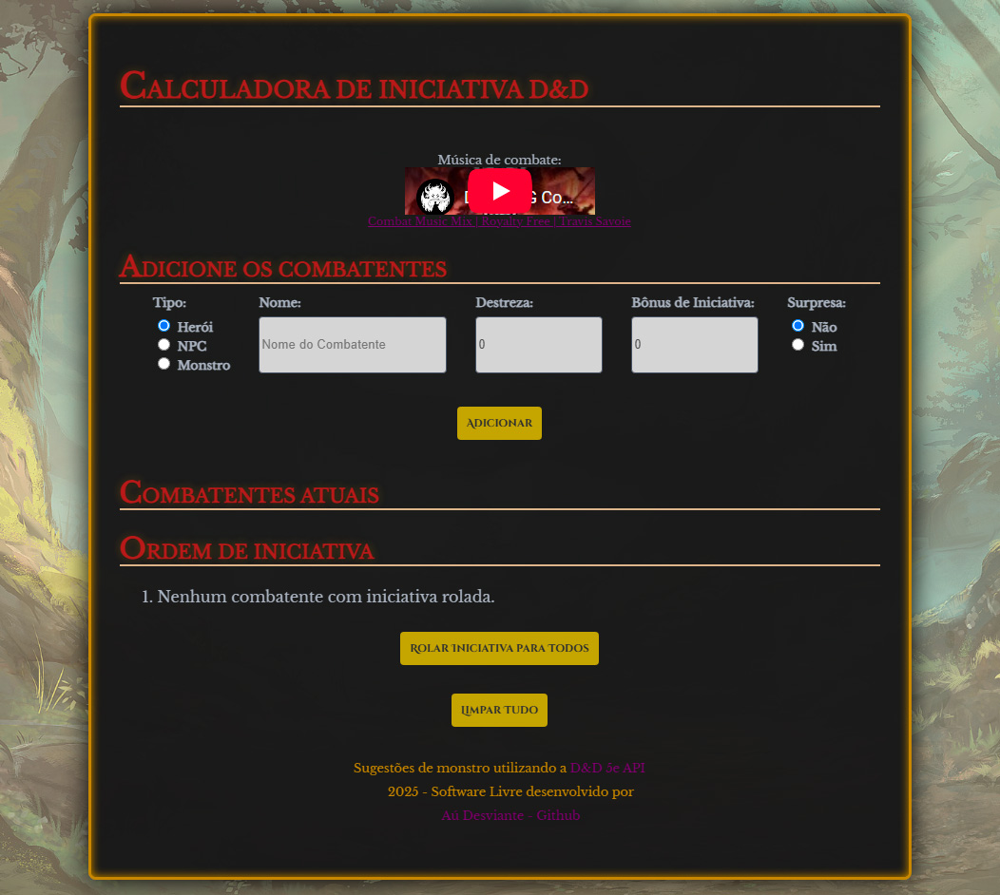

# Dungeons and Dragons initiative calculator

## Demonstração

## Funcionalidades

- Adicione combatentes (Herói's, NPC's ou Monstros) com nome, bônus de iniciativa e destreza.
- Marque combatentes como surpresos ou caídos.
- Role iniciativa individualmente ou para todos os combatentes.
- Exibe a ordem de iniciativa, colocando surpresos por último e caídos riscados.
- Modifique o bônus de iniciativa a qualquer momento.
- Interface temática inspirada em D&D.
- Player de música de combate integrado.

## Tecnologias

- JavaScript
- CSS
- HTML

## Como usar

1. Acesse: [https://lgjor.github.io/ddinitiativecalculator/](https://lgjor.github.io/ddinitiativecalculator/)

## Licença

Software livre desenvolvido por [Aú Desviante - Github](https://github.com/lgjor)  
Sinta-se à vontade para usar, modificar e contribuir!
